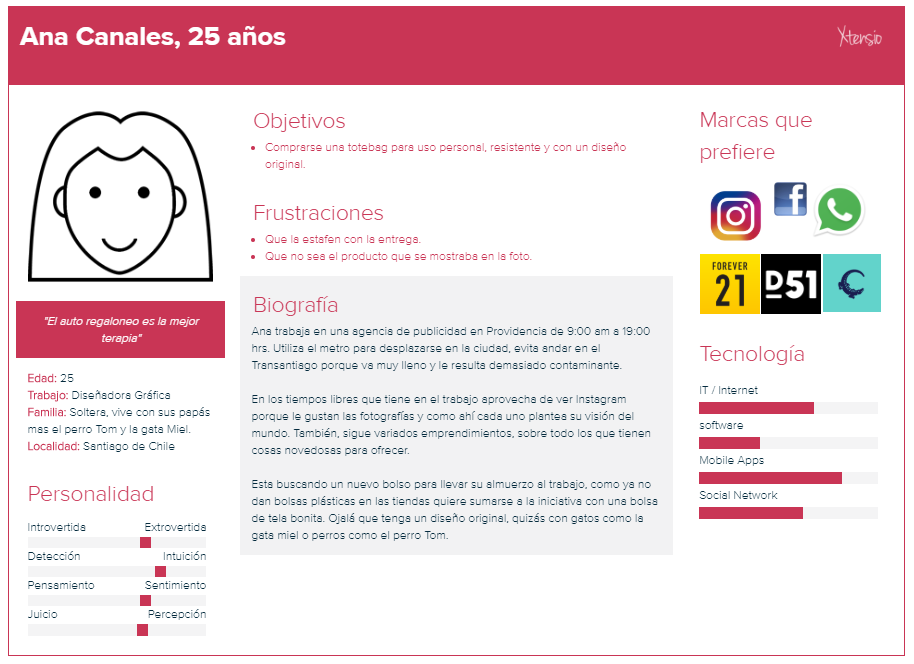
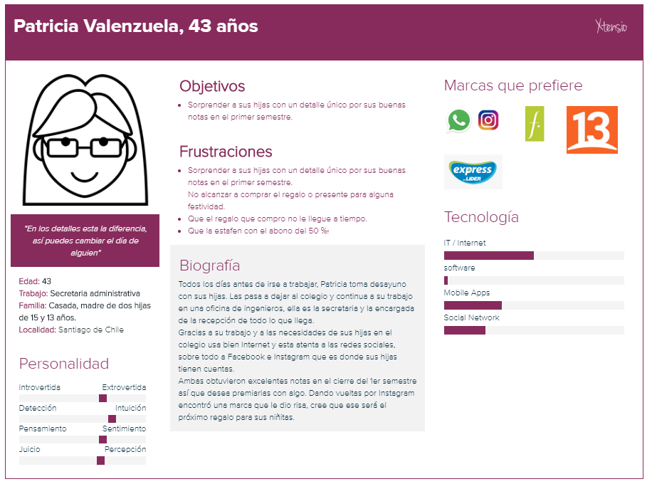
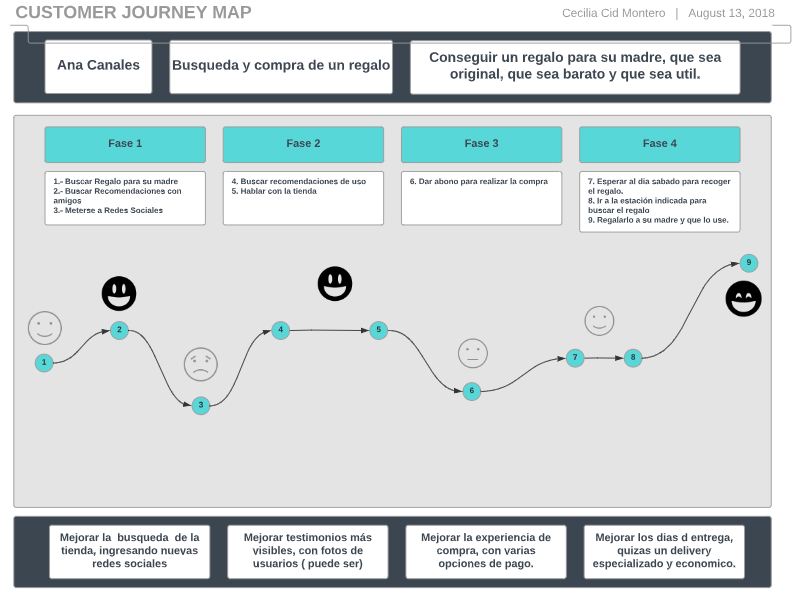

# Plataforma de ventas en línea

En Chile existen alrededor de 1.992.578 microemprendedores, formales o informales,de acuerdo a la V Encuesta de Microemprendimiento (EME) 2017, realizada por el Ministerio de Economía y el Instituto Nacional de Estadísticas (INE).

Solo el 39,2% es liderado por mujeres, este es el caso de [Mala Madre Store](https://www.instagram.com/malamadrestore/).
El emprendimiento de Marlenne Peña, consiste en la confección de monederos, estuches, fundas para laptop, tablet, morrales y totebag, además de cojines decorativos con formas de animales. Todos utilizan la técnica de la sublimación y son elaborados 100 % por las manos de su dueña.

  

<h3> Objetivos del proyecto </h3>
Asesorar a uno de los miembros de la Asociación Nacional de Pequeños Comerciantes en la creación de un portal desde donde los consumidores adquieran sus productos sin intermediarios. 

### Problemas identificados en la investigación (del cliente y del usuario)

Luego de una entrevista con el emprendimiento identificamos que:
* MalaMadreStore está <b> inserto solo en una red social </b> : Instagram, esto limita su público a solo los usuarios de esa red. 
* Las  <b>entrega</b>s las realiza solo los días <b>sábado a las 13:30 en el metro Quinta Normal</b>, previo abono de al menos el 50 % del total de la compra. 
Los usuarios que no pueden ese día deben gestionar una posible entrega en metro Irarrazaval donde la pareja de Marlenne tiene su trabajo y si eres de región, puedes gestionar envió por pagar a través de starken.
* Ambas opciones de entrega en Santiago, limitan al público que quiere adquirir un producto de un día para otro o en menos tiempo, que tener que esperar el día sábado
* En sus redes sociales, <b>no existe un catalogo con precios, productos, medidas de productos</b> que permitan a los usuarios ver todo lo que pueden adquirir de la tienda. Esto lleva a que MalaMadreStore, tenga menos venta porque pierde clientes al no dejar clara esta información y que no se dan el trabajo de revisar su Instagram para ver todo lo que hace. 

|Problema 1 |Problema 2| Problema 3|
|:----|:---|:---:|
|Solo una red social: Instagram| Hora y día de entrega: Sábado 13:30 hrs. metro Quinta Normal| No existe catálogo de productos|

|Solución 1 |Solución 2| Solución 3|
|:----|:---|:---:|
|Abrir cuentas en otras redes sociales como Facebook para llegar a otros públicos.|Gestionar un sistema de entregas amigable que funcione otros días a la semana | Gestionar un catálogo con medidas, precios, diseños de todos los productos que realiza. |

Luego de revisar las cuenta de Instagram de MalaMadreStore identificamos tres problemas: 

|Problema 1 |Problema 2| Problema 3|
|:----|:---|:---:|
|No existe una transparencia en los precios. Cuando una persona consulta el valor la emprendedora responde que por interno. Lo que obligatoriamente lleva a que le debas escribir.| No se sabe claramente cuáles son todos los productos que ella confecciona debido a que encuentras una gran variedad de artículos si revisas sus fotos de instagram. | No está claro la forma de compra ni de pago al momento de ingresar a la cuenta de instagram.|

|Solución 1 |Solución 2 | Solución 3|
|:----|:---|:---:|
|Catalogo con precios claros |Catalogo con todos los productos que ella realiza con diseños y medidas| Gestionar un carrito de compra con detalle y pago online de los productos. |

### Definición del público objetivo

  

  

  

### Customer Journey Map

  

### Definición de la solución/producto

> Luego de investigar el emprendimiento, consideramos que la solución para mejorar su sistema de ventas es unificar las plataformas de comunicación entre las personas que desean adquirir los productos y la misma dueña de la marca. 
Por ello, vamos a crear un sitio web para concretar las ventas a través de un sistema de compra online con carro de compras el que además tendrá en su interfaz un detalle de todos los productos que MalaMadre realiza. 
Se abrirá una cuenta en Facebook que se complementará con la de Instagram que ya existe y su uso será solo para difusión y promoción de los productos, complementado con las experiencias de otras personas que ya lo hayan adquirido. 
Con esto, esperamos que exista un proceso más expedito y flexible para comprar y despachar los productos. A su vez esperamos que de esta forma pueda llevar un flujo más ordenado de sus ventas. 

Link a prototipo navegable
Explicación de cómo los contenidos y funcionalidades responden a los objetivos del proyecto.

Explicación de cómo los contenidos y funcionalidades resuelven cada uno de las necesidades del usuario final.
Link de Zeplin, InVision inspects o Marvel Hand-offs para compartir tus diseños con desarrolladores.
